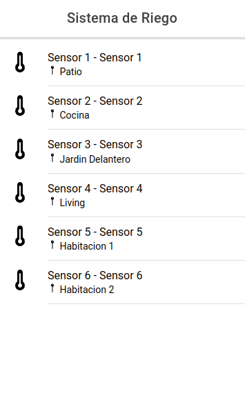
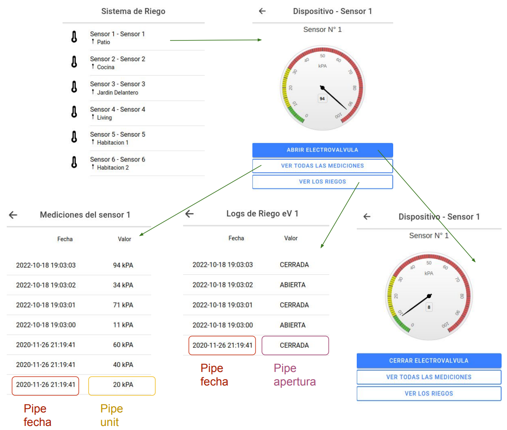
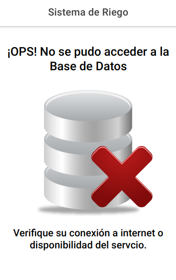
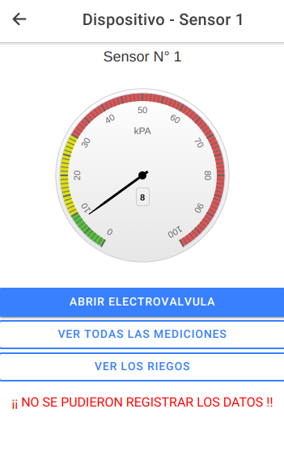

# TP-DAM-FINAL-Frontend

## Descripción de la aplicación 

La aplicación a desarrollar es un sistema de riego el cual utiliza sensores ubicados en distintos puntos.
Estos sensores consisten en un medidor de vacío y un tubo sellado con una capa de cerámica porosa.
La capa de cerámica simula movimiento del agua a través del suelo. Mientras más seco se encuentra el suelo, más alta será la lectura del tensiómetro.
La interpretación de la lectura de un tensiómetro varía según el cultivo, el tipo de suelo y curva de humedad correlacionada. 
En función de la lectura obtenida se debera realizar el riego del cultivo mediante el accionamiento de una electroválvula.

### Estructura

La aplciación está compuesta por un Frontend y un Backend. El Frontend se encuentra dockerizado en un docker compose que contiene las imágenes por medio de la cuales se implementa la bases de datos MySQL y el entorno de ejecución de JavaScript NodeJS necesarios para la implementación de la API. 

El BackEnd esta desarrollado en Ionic Framework, con el fin de brindar una agradable experiencia al usuario y la posibilidad de su implementación multiplataforma.

La comunicación entre el Backend y Frontend se realiza por medio del protocolo HTTP utilzando los métodos GET y PUT.


   
   
### Descargar el código

Para descargar el código, lo más conveniente es que realices un `fork` de este proyecto a tu cuenta personal haciendo click en [este link](https://github.com/chelogithub/TP-DAM-FINAL-Frontend/fork). Una vez que ya tengas el fork a tu cuenta, descargalo con este comando (acordate de poner tu usuario en el link):

```
git clone https://github.com/USER/TP-DAM-FINAL-Frontend.git
```

> En caso que no tengas una cuenta en Github podes clonar directamente este repo.

### Requisitos para el Frontend

El framework de `ìonic` requiere versiones de node js superiores a la 12, si no sabes la versión que tenés instalada o que versión descargar, recomiendo que instales el `nvm Node Version Manager`, esta herramienta presenta una linea de comandos amigable para instalar la versión de node que necesitas para correr ionic.

### Organización del proyecto

En la siguiente ilustración podés ver cómo está organizado el proyecto para que tengas en claro qué cosas hay en cada lugar.

```sh
├── db                          # directorio de la DB
│   ├── data                    # estructura y datos de la DB
│   └── dumps                   # directorio de estructuras de la DB
│       └── TPF-DAM-FINAL.sql   # estructura con la base de datos "DAM"
├── api                         # directorio de la api
│   ├── mysql                   # configuraciòn de pool de conexiones a la db
│   │   └── index.js            # archivo de configuraciòn de pool de conexiones a la db
│   ├── routes                  # rutas para los endpoints del backend
│   │   ├── dispositivo         # carpeta de ruta de endpoints para dispositivos
│   │   │    └── index.js       # archivo endpoints para dispositivos
│   │   ├── logRiego            # carpeta de ruta de endpoints para logRiegos
│   │   │    └── index.js       # archivo endpoints para logRiegos
│   │   └── medicion            # carpeta de ruta de endpoints para medicion
│   │        └── index.js       # archivo endpoints para medicion
│   └── index.js                # codigo del Backend 
├── docs                        # documentacion general del proyecto
├── docker-compose.yml          # archivo donde se aloja la configuracion completa de docker
├── README.md                   # este archivo
├── package.json                # configuracion de proyecto NodeJS
└── package-lock.json           # configuracion de proyecto NodeJS
```
### Poner en marcha el Frontend

Para poner en marcha el Backend debemos ejecutar  el comando `ionic serve` desde la raíz del proyecto. Este comando va a arrancar el Frontend en la siguiente direcciòn http://localhost:8100. Donde aparecerá la siguiente pantalla.



El acceso a esta vista implica la comunicación con la base de datos para obtener la lista de dispositovos que se ha graficado. Dicha comunicación se realiza a través de un servicio denominando `ApiConnService` el cual se encarga de realizar todas las consultas a la base de datos consultando los endpoints expuestos en el Backend.

### 

```js
 getDispositivo(id): Promise<Dispositivo> {

    this.dispositivo = this._http.get<Dispositivo>('http://localhost:8000/api/dispositivo/'+ id).toPromise();
    return this.dispositivo;
  }
  getDispositivos(): Promise<Array<Dispositivo>> {

    this.dispositivos = this._http.get<Array<Dispositivo>>('http://localhost:8000/api/dispositivo/').toPromise();
    return this.dispositivos;
  }

  getUltimaMedicion(id): Promise<Medida>  {
    this.medicion = this._http.get<Medida>('http://localhost:8000/api/medicion/' + id).toPromise();
    return this.medicion;
   }

   getMediciones(id): Promise<Array<Medida>> {
    this.mediciones = this._http.get<Array<Medida>> ('http://localhost:8000/api/medicion/' + id +'/todas/').toPromise();
    return this.mediciones;
   }

   getLogsRiego(id): Promise<Array<Log>> {
    this.logs = this._http.get<Array<Log>> ('http://localhost:8000/api/logRiego/' + id).toPromise();
    return this.logs;
   }

   getLogsRiegoEv(id): Promise<Log> {
    this.logEv = this._http.get<Log> ('http://localhost:8000/api/logRiego/' + id + '/estado').toPromise();
    return this.logEv;
   }
   postLogRiego(estadoEv,fechadate,ev): Promise<any> {
    const body ={'apertura': estadoEv,'fecha': fechadate ,'electrovalvulaId':ev};
    return this._http.post<any>('http://localhost:8000/api/logRiego/add',body).toPromise();
  }
  postMedicion(fechadate,valorMed,dispId): Promise<any> {
    const body ={'fecha': fechadate,'valor': valorMed,'dispositivoId':dispId};
    return this._http.post<any>('http://localhost:8000/api/medicion/add',body).toPromise();
  }
```

### Navegación por el FrontEnd

Te damos un breve vistazo por el layout de navegación del FrontEnd donde porás observar las pages que se encuentran disponibles y cual es su circuito.



En el caso de haber problemas con la conectividad el Backend aparecerán las siguientes pages, indicando la falla.



Falla durante el accionamietno de electroválvula




### Organización de la base de datos.

La base de datos se encuentra formada por 4 tablas
                
1. Mediciones
2. Dispositivos
3. Electrovalvulas
4. Log_Riegos

Las realaciones entre las tablas se observan en el siguiente diagrama.

   
   
### Conexión de la base de datos.

La conexión a la base de datos se realiza por medio de un pool de conexiones medainte la configuración de la variable configMysql, luego se crea el pool de conexiones con la configuración de la variable y se exporta el módulo `pool` con el método `query` para realizar las consultas a la bd.

```js
var configMysql = {
    connectionLimit: 10,      
    host: 'mysql-server',
    port:  '3306',
    user: 'root',
    password: 'userpass',
    database: 'DAM'
}
```

En el caso de presentarse errores en la conexión se informorá por conosola

```js
var pool = mysql.createPool(configMysql);
pool.getConnection( (err, connection) => {
    if (err) {
        switch (err.code) {
            case 'PROTOCOL_CONNECTION_LOST':
                console.error('La conexion a la DB se cerró.');
                break;
            case 'ER_CON_COUNT_ERROR':
                console.error('La base de datos tiene muchas conexiones');
                break;
            case 'ECONNREFUSED':
                console.error('La conexion fue rechazada');
        }
        if (connection) {
            connection.release();

        }
        return;
    }
});
```
Los endpoints de la api se encuentran ruteados para mantener el código ordenado como se observa en las carpetas de la organización del proyecto.

-------------
### Endpoints de dispositivo.
-------------

A continuación se detallan los endpoints y sus respuestas

Listado de dispositivos http://localhost:8000/api/dispositivo/
```json
[{"dispositivoId":1,"nombre":"Sensor 1","ubicacion":"Patio","electrovalvulaId":1},
{"dispositivoId":2,"nombre":"Sensor 2","ubicacion":"Cocina","electrovalvulaId":2},
{"dispositivoId":3,"nombre":"Sensor 3","ubicacion":"Jardin Delantero","electrovalvulaId":3},
{"dispositivoId":4,"nombre":"Sensor 4","ubicacion":"Living","electrovalvulaId":4},
{"dispositivoId":5,"nombre":"Sensor 5","ubicacion":"Habitacion 1","electrovalvulaId":5},
{"dispositivoId":6,"nombre":"Sensor 6","ubicacion":"Habitacion 2","electrovalvulaId":6}]
```
Consulta de dispositivo http://localhost:8000/api/dispositivo/1

```json
[{"dispositivoId":1,"nombre":"Sensor 1","ubicacion":"Patio","electrovalvulaId":1},
```
-------------
### Endpoints de medicion.
-------------

A continuación se detallan los endpoints y sus respuestas

Ultima medición por id de dispositivo http://localhost:8000/api/medicion/1
```json
[{"medicionId":15,"fecha":"2022-10-18T19:03:03.000Z","valor":"94","dispositivoId":1}]
```
Mediciones por id de dispositivo http://localhost:8000/api/medicion/1/todas

```json
[{"medicionId":15,"fecha":"2022-10-18T19:03:03.000Z","valor":"94","dispositivoId":1},
{"medicionId":14,"fecha":"2022-10-18T19:03:02.000Z","valor":"34","dispositivoId":1},
{"medicionId":13,"fecha":"2022-10-18T19:03:01.000Z","valor":"71","dispositivoId":1},
{"medicionId":12,"fecha":"2022-10-18T19:03:00.000Z","valor":"11","dispositivoId":1},
{"medicionId":1,"fecha":"2020-11-26T21:19:41.000Z","valor":"60","dispositivoId":1},
{"medicionId":2,"fecha":"2020-11-26T21:19:41.000Z","valor":"40","dispositivoId":1},
{"medicionId":8,"fecha":"2020-11-26T21:19:41.000Z","valor":"20","dispositivoId":1}]
```
Agregar medición por id de dispositivo http://localhost:8000/api/medicion/add

Metodo POST parámetros enviado en el body

```json
[{"fecha":"2022-10-11 14:56:59","valor":"35","dispositivoId":"2"}]
```

respuesta
```json
{
    "fieldCount": 0,
    "affectedRows": 1,
    "insertId": 27,
    "serverStatus": 2,
    "warningCount": 0,
    "message": "",
    "protocol41": true,
    "changedRows": 0
}
```
-------------
### Endpoints de Logs de Riego.
-------------

A continuación se detallan los endpoints y sus respuestas

Listado de Logs de Riego por electroválvula http://localhost:8000/api/logRiego/1

```json
[{"logRiegoId":10,"apertura":0,"fecha":"2022-10-18T19:03:03.000Z","electrovalvulaId":1},
{"logRiegoId":9,"apertura":1,"fecha":"2022-10-18T19:03:02.000Z","electrovalvulaId":1},
{"logRiegoId":8,"apertura":0,"fecha":"2022-10-18T19:03:01.000Z","electrovalvulaId":1},
{"logRiegoId":7,"apertura":1,"fecha":"2022-10-18T19:03:00.000Z","electrovalvulaId":1},
{"logRiegoId":1,"apertura":0,"fecha":"2020-11-26T21:19:41.000Z","electrovalvulaId":1}]
```
Ultimo estado de electroválvula por id http://localhost:8000/api/logRiego/1/estado

```json
[{"logRiegoId":10,"apertura":0,"fecha":"2022-10-18T19:03:03.000Z","electrovalvulaId":1}]
```

Agregar log de riego por id de electroválvula http://localhost:8000/api/logRiego/add

Metodo POST parámetros enviado en el body

```json
[{"apertura":"0","fecha":"2022-10-10 13:22:32","electrovalvulaId":"3"}]
```

respuesta
```json
{
    "fieldCount": 0,
    "affectedRows": 1,
    "insertId": 22,
    "serverStatus": 2,
    "warningCount": 0,
    "message": "",
    "protocol41": true,
    "changedRows": 0
}
```
